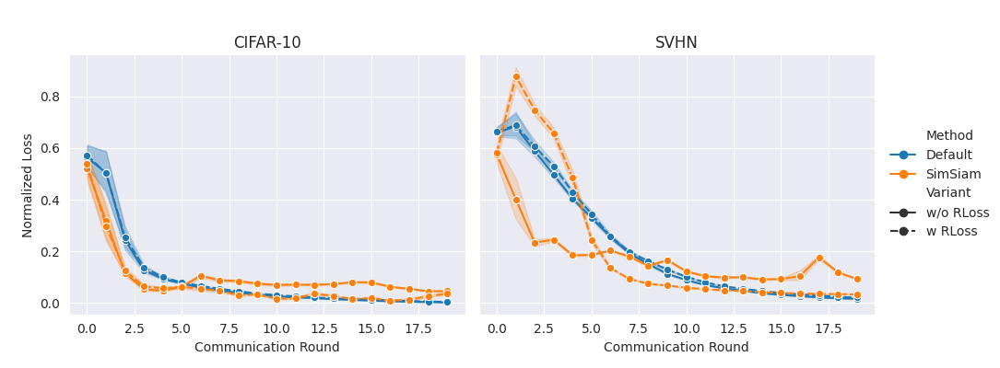
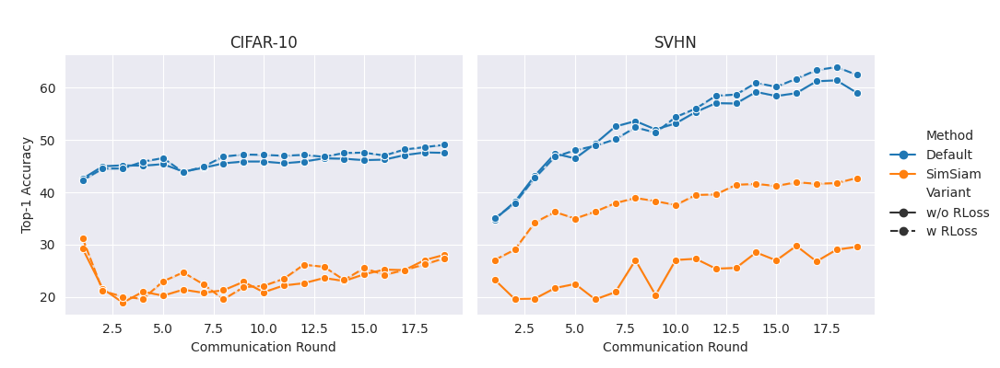
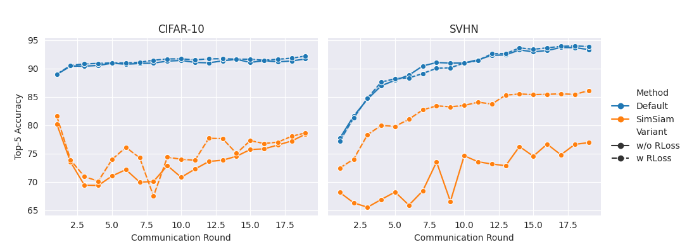

# FedX with SimSiam

This repository contains an **unsupervised federated learning** framework, based on **FedX** \[[Han et al., 2022\]](#han2022fedx), extended to use **SimSiam** \[[Chen & He, 2020\]](#chen2020simsiam) for self-supervised learning. The project aims to explore how a lightweight method like SimSiam performs in non-IID, privacy-critical federated settings.

## Overview

- **FedX**: An unsupervised FL method using cross-knowledge distillation.  
- **SimSiam**: A non-contrastive self-supervised method that avoids large negative sets, potentially suitable for low-end devices.

I compare **SimSiam** against the original FedX approach on **CIFAR-10** and **SVHN** datasets, analyzing top-1/top-5 accuracy and loss over communication rounds.

## Key Results

**Loss Over Communication Rounds**  


**Top-1 Accuracy**  


**Top-5 Accuracy**  


In general, SimSiam shows lower accuracy than the original method but benefits from reduced reliance on large batch sizes. Adding the “relational loss” helps stabilize training and often boosts performance.

## Installation

1. Clone the repository:
   ```bash
   git clone https://github.com/r3lativo/FEDX-mod
   cd FEDX-mod
   ```
2. (Optional) Create a virtual environment and install dependencies:
   ```bash
   conda create -n fedx-simsiam python=3.10
   conda activate fedx-simsiam
   pip install -r requirements.txt
   ```

## Usage

Below is an example command for running a federated training session with **SimSiam**:
```bash
python main.py \
    --model resnet18 \
    --dataset cifar10 \
    --partition non-iid \
    --method simsiam \
    --batch-size 256 \
    --epochs 5 \
    --comm_round 20 \
    --n_parties 10 \
    --portion 0.1 \
    --rel_loss
```
- `--model`: Choose the encoder architecture (e.g., `resnet18`).  
- `--dataset`: Dataset name (e.g., `cifar10`, `svhn`).  
- `--partition`: Data partition scheme (`non-iid` or `iid`).  
- `--method`: `default` (original FedX) or `simsiam`.  
- `--rel_loss`: Whether to include the relational loss.  

See [`main.py`](./main.py) or your primary script for additional arguments.

More simply, one can use the bash files to have some simple runs one after the other:

```bash
./run1.sh
```

## Repository Structure

- **`data/`**: Where the data is downloaded.
- **`logs/`**: Contains .log files of the runs.
- **`analysis.ipynb`**: Analysis Jupyter Notebook.  
- **`datasets.py`**: Utility to download and prepare the datasets.  
- **`losses.py`**: Where the loss functions are stored.  
- **`main.py`**: Entry point for federated training.  
- **`model.py`**: Contains the architectures used in this repo.  
- **`resnetcifar.py`**: Building blocks of the models.  
- **`utils.py`**: Utility scripts (data loaders, federated helpers).
- **`README.md`**: You are here!

## References

- <a name="han2022fedx"></a> **Han et al., 2022**: *FedX: Unsupervised Federated Learning with Cross Knowledge Distillation*  
- <a name="chen2020simsiam"></a> **Chen & He., 2020**: *Exploring Simple Siamese Representation Learning*  